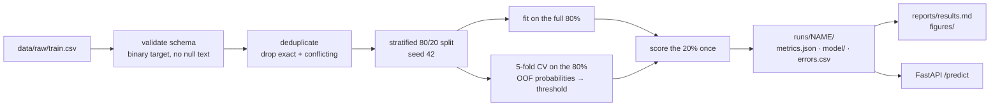
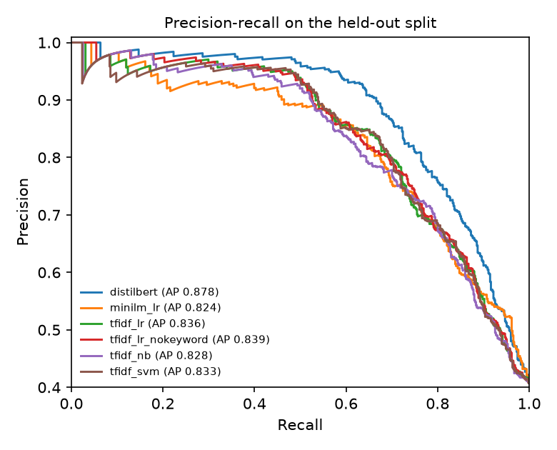
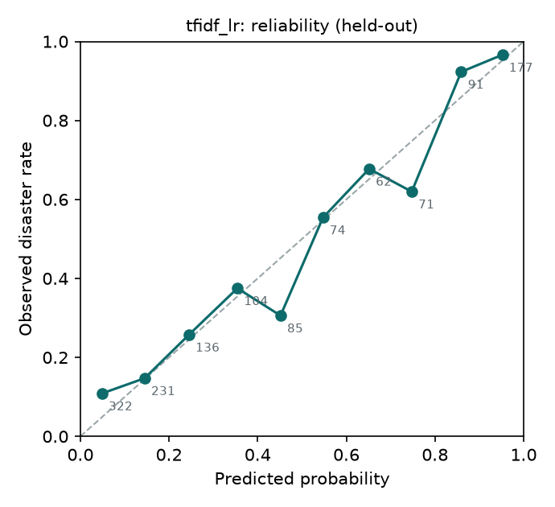
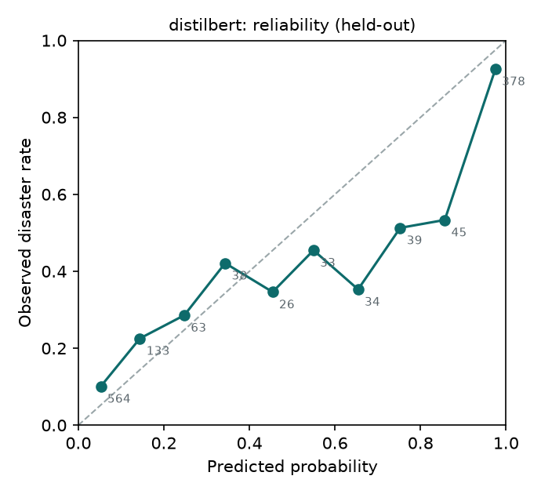
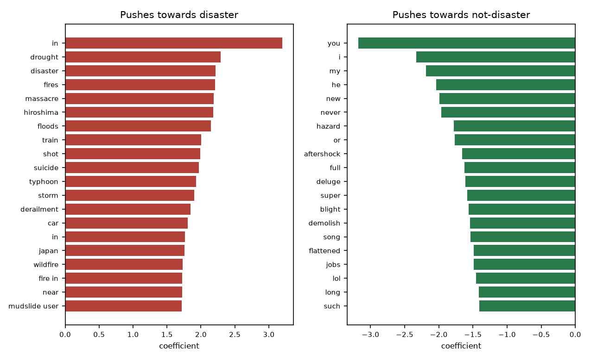

# Disaster tweet classification

Given a tweet, decide whether it reports a real disaster. Same task as the Kaggle "Natural Language Processing with Disaster Tweets" competition, rebuilt as a small, reproducible ML project: five models from a TF-IDF baseline to a fine-tuned transformer, one evaluation protocol, calibration and error analysis, tests, CI, and a served model.

This repository started in 2020 as a set of notebooks (kept under `legacy/`). Everything at the top level is the 2026 rebuild.

## Why the problem matters

Emergency services and newsrooms monitor social media for incident reports. The hard part is not the vocabulary: "fire", "flood" and "crash" are used far more often figuratively ("this mixtape is fire") than literally. A useful classifier has to separate literal disaster reports from metaphor, news commentary and jokes, and it has to give a calibrated probability so a downstream team can pick an operating point that matches their review capacity.

## Data

Kaggle's training file, 7,613 labelled tweets, 43% positive, is committed under `data/raw/` (about 1 MB). Two things about it shape the whole project:

| | rows |
|---|---|
| raw training rows | 7,613 |
| exact duplicate texts dropped (after URL and mention removal) | 637 |
| texts appearing with **both** labels, dropped entirely | 156 rows across 78 distinct texts |
| rows used | 6,763 (5,410 train, 1,353 held out) |

Duplicates leak across a random split and inflate every metric; conflicting labels put a ceiling on achievable accuracy and, when they survive into the held-out set, punish a model for being right. `disaster_tweets.data.deduplicate` removes both and writes the counts into every run's metrics file. The 78 conflicting texts are also a hint about the labels in general, which the error analysis confirms.

## Pipeline



Text preprocessing is deliberately light (`disaster_tweets.preprocess`): HTML entities decoded, URLs and @mentions replaced by placeholder tokens rather than deleted, `#` stripped from hashtags, whitespace collapsed. Stemming and stop-word removal were tried in the 2020 notebooks and only hurt; n-gram and transformer models get more from the raw tokens. The Kaggle `keyword` column (present on 99% of rows) is prepended to the text.

## Models

All models share one interface (`fit`, `predict_proba`, `save`, `load`) and are selected by name from a YAML config in `configs/`:

| name | what it is | why it is here |
|---|---|---|
| `tfidf_lr` | word 1–2-gram + char 2–5-gram TF-IDF → logistic regression | the baseline to beat; fast, calibrated, interpretable down to the n-gram; **served by the API** |
| `tfidf_svm` | same features → linear SVM, sigmoid-calibrated | usually the strongest linear model on short text |
| `tfidf_nb` | same features → complement naive Bayes | the classical text baseline; poorly calibrated by construction, which the ECE column shows |
| `minilm_lr` | frozen `all-MiniLM-L6-v2` sentence embeddings → logistic regression | does pretrained semantics beat lexical features without any fine-tuning? |
| `distilbert` | `distilbert-base-uncased` fine-tuned end to end, 3 epochs, lr 3e-5, max 64 tokens | the transformer reference point |

## Evaluation protocol

- **Split once.** 20% is held out with a fixed seed before anything else happens and is scored exactly once per run.
- **Choose the threshold on out-of-fold predictions.** 5-fold stratified CV on the 80% produces OOF probabilities; the F1-maximising threshold is read off those, then applied unchanged to the held-out split. Reporting F1 at a threshold tuned on the test set is the most common way these numbers get inflated, and this pipeline cannot do it.
- **Report probabilities, not just labels.** ROC-AUC and PR-AUC are threshold-free; Brier score and expected calibration error (10 bins) say whether the probability can be trusted, which matters more than a point of F1 when a human sets the operating point.
- **Keep the mistakes.** Every run writes `errors.csv`, the misclassified held-out rows sorted by how confident the model was.

## Results

Held-out split (1,353 tweets), threshold chosen on out-of-fold predictions, from `reports/results.md`. Fit time is on an Apple M5.

| run | CV F1 (5-fold, t=0.5) | t | F1 | Precision | Recall | ROC-AUC | PR-AUC | Brier | ECE | fit (s) |
|---|---|---|---|---|---|---|---|---|---|---|
| distilbert | 0.787 ± 0.021 | 0.56 | **0.780** | 0.813 | 0.750 | 0.889 | 0.878 | 0.131 | 0.076 | 181 |
| minilm_lr | 0.744 ± 0.020 | 0.43 | **0.742** | 0.729 | 0.755 | 0.855 | 0.824 | 0.147 | 0.043 | 13 |
| tfidf_nb | 0.734 ± 0.019 | 0.24 | **0.739** | 0.733 | 0.746 | 0.845 | 0.828 | 0.164 | 0.129 | 0 |
| tfidf_svm | 0.738 ± 0.018 | 0.39 | **0.735** | 0.711 | 0.760 | 0.851 | 0.833 | 0.144 | 0.053 | 1 |
| tfidf_lr_nokeyword | 0.737 ± 0.018 | 0.52 | **0.734** | 0.805 | 0.675 | 0.854 | 0.839 | 0.144 | 0.040 | 1 |
| tfidf_lr | 0.737 ± 0.018 | 0.34 | **0.734** | 0.691 | 0.782 | 0.852 | 0.836 | 0.144 | 0.041 | 0 |



What the table says:

- **Fine-tuning is worth about 4.5 F1 points here** (0.780 vs 0.734), well outside the ±0.02 fold-to-fold spread, and it buys them mostly as precision (0.81 vs 0.69). For context, the Kaggle leaderboard tops out around 0.84 on its own test set with heavier transformers and ensembles; these numbers are on a deduplicated split, which removes leakage and lowers every score.
- **All four linear and frozen-embedding models are within noise of each other.** Frozen MiniLM embeddings do not beat character n-grams; pretrained semantics only pay off once the encoder is fine-tuned.
- **The keyword column adds nothing** for the linear model (0.734 either way). It shifts the threshold and trades recall for precision but not the ranking quality (ROC-AUC 0.852 vs 0.854).
- **Calibration favours the linear models.** Logistic regression and calibrated SVM have ECE around 0.04; DistilBERT is 0.076 and naive Bayes 0.129. If the probability feeds a review queue rather than a hard label, DistilBERT would want a post-hoc temperature scaling step that this pipeline does not yet include.

 

### Error analysis

Every run writes its misclassified held-out rows, most confident first, to `runs/<name>/errors.csv`. DistilBERT makes 233 errors (138 false negatives, 95 false positives); the TF-IDF baseline makes 313, and 166 of those rows are shared. Reading the shared, high-confidence ones by hand gives four categories:

1. **Label noise.** The most confident false negatives are tweets labelled as disasters that are not: *"Pandemonium use to be my fav cd"*, *"'@jorrynja: 6. @ your bf/gf/crush ??'"*, *"Hey the #Royals love doing damage with 2 outs."* Both models score these below 0.04 and both are right. Together with the 78 texts that appear in the file with both labels, this puts the practical ceiling for any model on this data well below F1 1.0.
2. **Reporting about disasters is not reporting a disaster.** *"Over half of poll respondents worry nuclear disaster fading from public consciousness"*, *"Teen Disaster Preparedness Event in Van Nuys"*. Labelled 0, scored above 0.97 by DistilBERT. The vocabulary is fully disaster-domain; the distinction is pragmatic, and neither model has any signal for it beyond surface form.
3. **Negation and metaphor.** *"Hazardous Weather Outlook: NO HAZARDOUS WEATHER IS EXPECTED"* (0.98), *"Nuclear deal disaster"* (0.99), *"she's a suicide bomb"* (0.83 for the baseline). Classic short-text failures; a fine-tuned model should handle the first and does not, which points at the small training set rather than the architecture.
4. **Ambiguous ground truth.** *"FAAN orders evacuation of abandoned aircraft at MMA"* is labelled 0 and scored 0.99. It is a real evacuation order; whether it is a "disaster" is a labelling-guideline question, not a modelling one.

The practical conclusions: a relabelling pass on the confident-error queue would raise every model's measured score more than another architecture would, and the pragmatic-context category (2) would need either examples of it in training data or a feature for "news headline about" versus "report of".

### Explaining the linear model

The strongest positive n-grams are place-and-event words in news register (*storm*, *hiroshima*, *derailment*, *typhoon*, *floods*, *near*, *in*, *at*); the strongest negative ones are first- and second-person pronouns and evaluative words (*i*, *you*, *my*, *love*, *new*). The model has largely learned "wire-service headline versus personal tweet", which explains both its strength and the failures in categories 2 and 3 above.

## Explainability

Logistic regression on TF-IDF is explainable without any extra tooling. Global weights:



Per prediction, the API returns the n-grams that contributed most, so "why did it say disaster?" has a direct answer:

```bash
dt-predict --run runs/tfidf_lr --explain "Forest fire near La Ronge Sask. Canada"
```

## Reproduce

```bash
git clone https://github.com/kiran-bal/disaster-tweet-classification && cd disaster-tweet-classification
make setup                  # uv venv + all extras; or: pip install -e ".[transformer,api,dev]"
make train                  # tfidf_lr in ~20 s: CV, fit, held-out metrics, figures
make train-all              # every config, then reports/results.md and the PR-curve figure
make test                   # 21 tests
```

The DistilBERT run needs a GPU or Apple Silicon for reasonable time (about 12 minutes for 5 folds plus the final fit on an M5); everything else runs on a laptop CPU in under a minute each. Seeds are fixed; sklearn runs are bit-reproducible, transformer runs reproduce to the third decimal.

## Serve

```bash
make serve                  # or: DT_RUN_DIR=runs/tfidf_lr uvicorn disaster_tweets.api:app --port 8000
curl -X POST localhost:8000/predict -H 'content-type: application/json' \
     -d '{"texts": ["Forest fire near La Ronge Sask. Canada", "this new album is fire"], "explain": true}'
```

```bash
make docker                 # image trains the baseline during build and serves it on :8000
```

## Project structure

```
configs/               one YAML per run
data/raw/              Kaggle train/test CSVs
src/disaster_tweets/
├── config.py          RunConfig, paths
├── preprocess.py      normalisation, dedupe key
├── data.py            load, validate, deduplicate, split
├── features.py        TF-IDF builders
├── models/            registry: sklearn, embeddings, transformer
├── evaluate.py        metrics, calibration, error table, figures
├── train.py           dt-train
├── predict.py         dt-predict, Predictor
├── compare.py         dt-compare → reports/results.md
└── api.py             FastAPI service
tests/                 preprocess, data, models, evaluate, api
reports/               results.md, figures/ (committed)
runs/                  per-run artefacts (gitignored; regenerate with make train-all)
legacy/                the 2020 notebooks, unchanged
Dockerfile · Makefile · .github/workflows/ci.yml
```

## Testing and CI

`pytest` covers preprocessing, de-duplication and splitting, every sklearn model's fit/predict/save/load round trip, the metrics and threshold logic, and the API through FastAPI's test client with a model trained on a toy fixture. GitHub Actions runs lint and tests on Python 3.11 and 3.12, smoke-trains the baseline and fails if held-out F1 falls below 0.70, then builds the Docker image and hits `/predict`.

## Limitations

- The labels are noisy. The error analysis shows the most confident "mistakes" are largely mislabelled rows, so the ceiling on this dataset is well below 1.0 and the ranking between the top models is within label noise.
- 7.6k tweets from 2015. Vocabulary, platforms and slang have moved; a deployed model would need periodic relabelling and retraining, which this pipeline supports but does not schedule.
- The transformer is served nowhere: the API deliberately serves the linear model because it is 30× smaller, explains itself, and is within a few F1 points. Swap `DT_RUN_DIR` to serve `runs/distilbert` if the trade is worth it for you.

## Future work

- Experiment tracking (MLflow) and a model registry once there is more than one person training.
- Label-noise handling: confident-learning style relabelling or training with the conflicting rows down-weighted rather than dropped.
- A small active-learning loop: the errors file is exactly the queue a labeller should see first.
